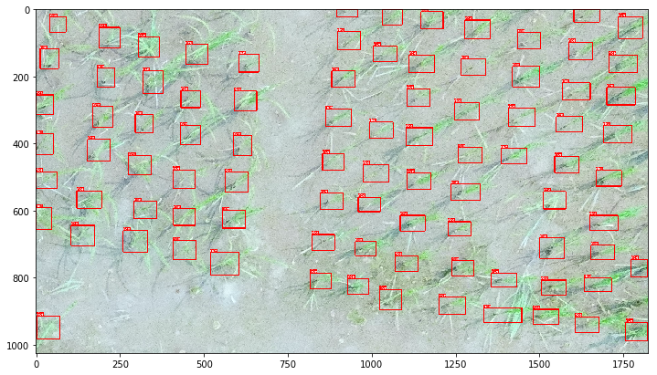
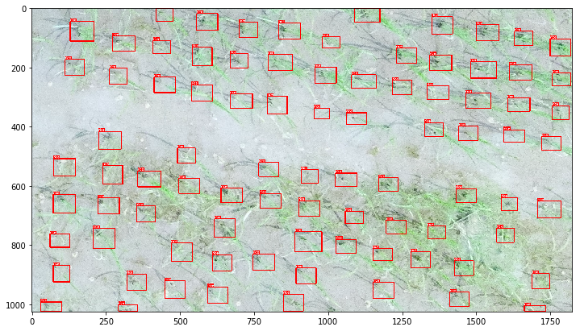

# Rice detection based Faster-Rcnn

## Introduction

A experiment that test Cascade Faster-Rcnn performance on Drone image. The model was based on mmdetection.

mmdetection is an open source object detection toolbox based on PyTorch. It is
a part of the open-mmlab project developed by [Multimedia Laboratory, CUHK](http://mmlab.ie.cuhk.edu.hk/).


2. Augmentation


Albu aug library

```Python
        self.light=A.Compose([A.RGBShift(),A.InvertImg(),
            A.Blur(),
            A.GaussNoise(),
            A.Flip(),
            A.RandomRotate90()], bbox_params={'format':'pascal_voc','min_visibility': 0.4, 'label_fields': ['category_id']}, p=1)
```


## Model config
```
dict(
    imgs_per_gpu=2,
    workers_per_gpu=2,
    train=dict(
        type=dataset_type,
        ann_file=data_root + 'annotations.pkl',
        img_prefix=data_root + 'train/',
        img_scale=[(384, 768), (768, 768)],
        img_norm_cfg=img_norm_cfg,
        size_divisor=32,
        flip_ratio=0,
        with_mask=False,
        with_crowd=True,
        with_label=True))
```


## Result
## Train a model







## Citation

If you use our codebase or models in your research, please cite this project.
We will release a paper or technical report later.

```
@misc{mmdetection2018,
  author =       {Kai Chen and Jiangmiao Pang and Jiaqi Wang and Yu Xiong and Xiaoxiao Li
                  and Shuyang Sun and Wansen Feng and Ziwei Liu and Jianping Shi and
                  Wanli Ouyang and Chen Change Loy and Dahua Lin},
  title =        {mmdetection},
  howpublished = {\url{https://github.com/open-mmlab/mmdetection}},
  year =         {2018}
}
```
>>>>>>> origin/master
